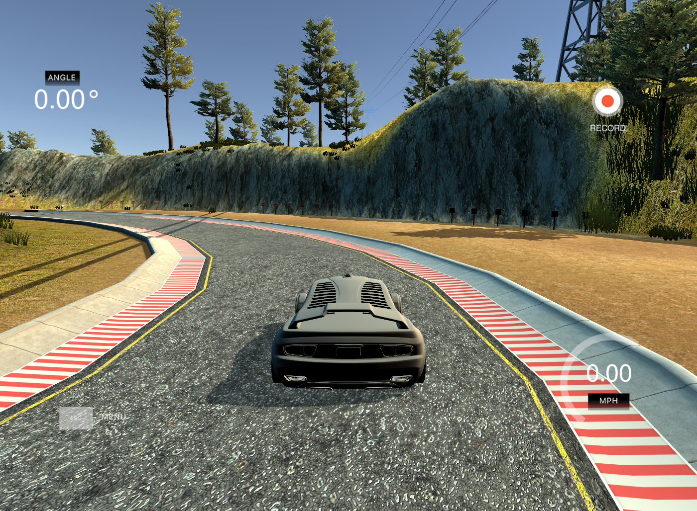
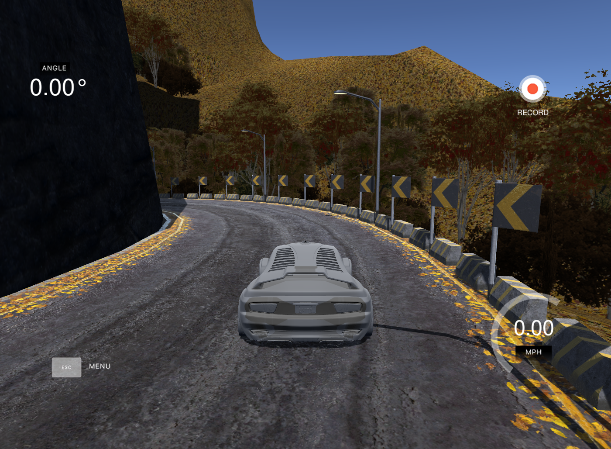

# Steer-Prediction from Camera Images for Self Driving Car (Draft 3)

Udacity's Self-Driving Car Nanodegree project 3 - Behavioural Cloning

## Abstract
The goal of this project is to train a deep learning model to predict steering angle for autonomous driving car in a simulator provided by Udacity. Using the vehicle's camera images captured from the human driving demonstration, we train a deep neural network to predict the vehicle's steering angle. The final trained model is evaluated both in the training track and an unseen testing track.

## Overview
The project is consisted of the following modules:
- Project Requirement
- Setup and Environment
- Exploring the data 
- Data Augmentation
- Deep Learning Model Design 
- Model Training 
- Performance & Evaluation
- Discussion
- Future Work
- Reference

## Project Requirement

Deep learning model is trained only on **Track 1** data. To assess the trained model's performance, the car has to successfully drive by itself without getting off the road on **Track 1** and drive the entire **Track 2** without getting off the road.

**Track 1**: *flat road, mostly straight driving, occasionally sharp turns, bright day light.*

**Track 2**: *hilly road, many light turns and sharp turns, dark environment*

## Setup and Environment

### Installation & Resources
1. Python 3.5
2. [Anaconda Environment](https://anaconda.org/hl395/autodrive35/2017.11.01.1933/download/autodrive35.yml)
3. Udacity Car Simulator on [Linux](https://d17h27t6h515a5.cloudfront.net/topher/2016/November/5831f0f7_simulator-linux/simulator-linux.zip)
4. Udacity [sample data](https://d17h27t6h515a5.cloudfront.net/topher/2016/December/584f6edd_data/data.zip)
5. Jupyter Notebook [Download](http://jupyter.org/) Both model training and drive programs are divided into steps with staged output and  detailed explanation. 

### Files and Usage
* `autodrive35.yml`: Anaconda Environment configuration file.

* `p3-behavioural-cloning.ipynb` : training program.

* `model.json`: saved training model.

* `model.h5`: saved training weights.

* `drive.ipynb`: program that takes `model.json` and `model.h5` as input to excute.

* **To use**: 
  - Start Simulator, pick track and choose Autonomous mode 
  - On `drive.ipynb`, specify path to `model.json` and `model.h5` 
  - Run cell in `drive.ipynb`

### Quickstart
* **1. Control of the car is by using button on PC keyboard or joystick or game controller:**

   :arrow_up: accelerate :arrow_down: brake :arrow_left: steer left :arrow_right: steer right

* **2. Two driving modes:**
  * Training: User demonstrates driving on track 
  * Autonomous: Car drives itself by receiving commands from program

* **3. Collecting data:**
  * User drives on track 1 and collects data by recording the driving experience by toggle ON/OFF the recorder. Data is saved as frame images and a driving log which shows the location of the images, steering angle, throttle, speed, etc. Training images were sampled at 10 Hz.
  * Another option is trying on Udacity data sample.

## Exploring the data

### Data Format/Component
* **Camera Frame:**
  * There are 3 cameras on the car which shows left, center and right images for each steering angle. 
    ![alt text][camera_frame]

* **Driving Log:**
  * After recording and save data, the simulator saves all the frame images in `IMG` folder and produces a `driving_log.csv` file which containts all the information needed for data preparation such as path to images folder, steering angle at each frame, throttle, brake and speed values.
    ![alt text][drive_log]

In this project, we only need to predict steering angle. So we will ignore throttle, brake and speed information.

### Smooth Steering Angle
Since driving data was collected using keyboard inputs, the input time-series is very choppy. To smooth the data, I used a simple moving average, with a window of 3 time units (i.e. 0.3 seconds). Below is a plot of the raw and smoothed steering angle over time, for a random section in my normal driving data: 
[Image here]

### Data Balancing 
Collected data is not balanced, we can see the steering angle historgram as shown below and data balancing is a crucial step for network to have good performance!

![alt text][samples_hist1]

In order to balance the data, first, we can draw a histogram to see which steering angle ranges are most dominating in the sample space(high bins in the drawing). Secondly, we can calculate average samples per bin(as **average_samples_per_bin**) by dividing the total number of samples by the number of bins(200). Thirdly, we can determine keep probability for each bin: if the number of samples in a bin is below **average_samples_per_bin**, keep all; otherwise, the keep probability is set proportional to the number of samples above the average, in order to bring the number of samples for that bin down to the average.

![alt text][samples_hist2]

We can see from above figure, still, most of the steer angles are around the center(0 degree). There is very low probability that we will pick up the large angle portion samples. Thus, we need to further reduce the number of high bins, and this is done by function `balance_data()`. I use this function to bring the number of samples in each bin to 100 at most among 100 bins. After these steps, I had 4417 number of data points. The results are shown below:

![alt text][hist]

## Data Augmentation
* **Image Flipping**: In track 1, most of the turns are left turns, so I flipped images and angles. As a result, the network would learn both left and right turns properly. Here is an image that has then been flipped:

![alt text][flip]

* **Brightness Augmentation**: In order to learn a more general model, I randomly changed the image's brightness in HSV space(function *brightness_change*):

![alt text][brightness]

* **Shadow augmentation**: To deal with tree, building or other object shadow on the road, random shadows are cast across the image. This is implemented by choosing random points and shading all points on one side (chosen randomly) of the image(function *add_random_shadow*):

![alt text][shadow]

* **Horizontal and vertical shifts**: To simulate the effect of car being at different positions (driving up or down the slope) on the road, we can shift the camera images horizontally (vertically) and add an offset corresponding to the steering angle. We added 0.004 steering angle units per pixel shift to the right, and subtracted 0.004 steering angle units per pixel shift to the left(function *trans_image*):

![alt text][shifted]

## Deep Learning Model Design

To find the best fitting model, I experimented with 3 existing models:
- [NVIDIA Model](http://images.nvidia.com/content/tegra/automotive/images/2016/solutions/pdf/end-to-end-dl-using-px.pdf)
- [Comma.ai Model](https://github.com/commaai/research/blob/master/train_steering_model.py)
- [Simplified VGG Net - with configuration A](https://arxiv.org/pdf/1409.1556.pdf) 

All of three models I explored share the following design structure:
1. First phrase: 
   * Normalize input image data to -1 to 1 or -0.5 to 0.5 range 
   * Color space conversion layer(Optional): enable the model to select between 3 color channels 
2. Second phrase: 
   * `Convolution Layer` are applied with 5x5 filter size but the depth increases at each layer such as 24, 36, 48. Then, 2 convolution layers are applied with 3x3 filter size and 64 depth. 
   * `Maxpooling Layer` can also be used at choice to decrease the input size
   * `ReLU/ELU Activation` is applied following every convolution layer 
3. Third phrase: 
   * `Dense Layer` -- Output from previous layer are flatten. Then dense to 80, 40, 16, 10 and 1. At each dense layer, 50% Dropout is also applied for the first 3 dense layer to avoid overfitting. L2 weight regularization is recommended in every convolution and dense layer to produce a smoother driving performance. After many trial and error, 0.001 produce best peformance for this model.
   * `Dropout Layer` -- To avoid overfitting, Dropout with certain percentage can be added before or after the dense layer.
4. Fourth phrase:
   * Optimizer(Learning Rate): Adam optimizer is suitable for this project, which can automatically adjust the learning rate. It is set with default value 0.001, but 0.0001 learning rate is recommended to avoid too aggressive error descedent and produce a smoother ride. Therefore, 0.0001 learning rate is selected.
   * Loss Function (or objective function, or optimization score function): Mean Squared Error(MSE) is used to measure the deviations of model predicted steering angle to human driver's steering angle.

Structure summary of above three models implemented with Keras:
### 1. NVIDIA Model
|Model           |  Model Layer Details |
|-------------------------|-------------------------|
|![alt text][model1] | ![alt text][model1_detail] |

### 2. Comma.ai Model 
|Model           |  Model Layer Details |
|-------------------------|-------------------------|
|![alt text][model2] | ![alt text][model2_detail] |

### 3. Simplified VGG Net - with configuration A
|Model           |  Model Layer Details |
|-------------------------|-------------------------|
|![alt text][model3] | ![alt text][model3_detail] |

## Model Training
### Image Crop
1. To help the system avoid learning other part of the image but only the track, we can crop the up part (sky) and bottom part (front part of the car deck) out of the image. Original image size (160x320), after cropping 60px on top and 20px on the bottom, and 10px from left and right, the new image size is (80x300).
2. To help running a smaller training model, images are scaled to size (66x200) from cropped size (80x300).
![alt text][process_image]

### Convert to YUV color channels
The input image is split into YUV planes and passed to the network (reference the [NVIDIA paper](http://images.nvidia.com/content/tegra/automotive/images/2016/solutions/pdf/end-to-end-dl-using-px.pdf)).
![alt text][convert2YUV]

### Training and Validation
Central images and steering angles are shuffle and split into 70/30 for Training/Validation using `shuffle` & `train_test_split` from `sklearn`. Finally randomly shuffled the data set and put 30% of the data into a validation set.

### Recovery
In general sense, driving behavior can be trained using the central images because we always look ahead when driving. Driving is mostly straight driving as well or small adjustment to turn the car unless there is a sharp turn. Below is the plot of steering angle on track 1 from Udacity data.

But from inutition, if our car goes off lane (for example, distraction during text and drive), we can adjust it back on track right away. The machine doesn't have this intuition, so once it goes off road it would be hard to recover. To teach the machine this kind of recovery knowledge, we have to show it the scenarios. Hence, we use left and right camera images. Udacity gives out a great hint how to apply this method.
>In the simulator, you can weave all over the road and turn recording on and off. In a real car, however, that’s not really possible. At least not legally.
>So in a real car, we’ll have multiple cameras on the vehicle, and we’ll map recovery paths from each camera. **For example, if you train the model to associate a given image from the center camera with a left turn, then you could also train the model to associate the corresponding image from the left camera with a somewhat softer left turn. And you could train the model to associate the corresponding image from the right camera with an even harder left turn.**

### Steering Angle Correction
When we process the left and right camera, we add corrections (+0.25 or -0.25) for their steering angles because we only know the ground-truth steering angle for the center camera (as given by Udacity simulator). Therefore, it may introduce some small errors for the steering angles of left and right images.  

The chosen left/right images and adjusted angles are then added into driving left or driving right lists. Here is the logic:
     **_adjustment_angle = 0.25_** 
  1. **Left turn**_(negative angle)_: + adjustment_angle on left image, - adjustment_angle on right image
  ![alt text][left_turn]
  2. **Right turn**_(positive angle)_: + adjustment_angle on left image, - adjustment_angle on right image
  ![alt text][right_turn]

### Generators
The model is trained using Keras with Tensorflow backend. My goal is to not generate extra data from what has been collected. To help always getting new training samples by apply random augmentation, fit_generator() is used to fit the training model.

There are two generators in this project. **Training generator** is to generate samples per batches to feed into fit_generator(). At each batch, random samples are picked, applied augmentation and preprocessing . So training samples feeding into model is always different. **Validation generator** is also to feed random samples in batches for validation, unlike training generator, only central images are used here and only proprocessing is applied.

## Performance & Evaluation

### 1. NVIDIA Model
![alt text][model1_track1_gif]

[Youtube track 1](https://youtu.be/is49elVxbgc?list=PLQefmzG-uoN76per1Sdg7212nH9LSKpi3)

![alt text][model1_track2_gif]

[Youtube track 2](https://youtu.be/GGblJz5YFFM?list=PLQefmzG-uoN76per1Sdg7212nH9LSKpi3)

### 2. Comma.ai Model

[Youtube link]

### 3. Simplified VGG Net - with configuration A
![alt text][model3_track1_gif]

[Youtube track 1](https://youtu.be/iyrtscvcQV8?list=PLQefmzG-uoN76per1Sdg7212nH9LSKpi3)

![alt text][model3_track2_gif]

[Youtube track 2](https://youtu.be/IRmzAbo1C2E?list=PLQefmzG-uoN76per1Sdg7212nH9LSKpi3)

## Discussion 
My proposed model is derived from VGG and LeNet, which is more complex than LeNet but smaller than VGG. Later, I found that my model had a low mean squared error on the training set but a high mean squared error on the validation set, which implied that the model was overfitting. So, I added tow dropout layers into the model and reduce the number of neurons in FC layers. Then I noticed that both the train loss and validation loss are small. 

While the car keep running in the simulator, I can prepare the document for the submission. This is the self driving car future we are looking for. We need overcome some obstacles: 
- Better training data
- More compute power
- Standardize Network Architecture
- It is a try and error approach, and engineering approach
- Working on real environment

## Future Work
The Udacity provided training data is not too bad. It does have some bad turns. And the model clones them. It is perfecty matched the title "behavioral clone". If you are good driver, it clones. If you are bad driver, it clones too. 
I think somehow it is hard to figure out who is better driver, human or machine.  

In the begining, I don't like this kind of sharp on and off keyboard driving input. Later, I found out the udacity dataset is already smoothed, or at least is joystick or wheeled controller input. I thought a smooth steering curve is better for the training, but it turn out not really the case. Over smoothed curve yield very aggressive turnning. Maybe it is a very good result, we just need fine tune the controller to handle it properly. Also, in the real world, most of the time, the steering wheel is in netural position. Train the machine not to over react is harder than keep moving. 

190 seconds to train 19200 66x200 size images on CPU, is not that bad. Somehow I find the GPU is not working as hard as I expected in the generator setting. Both my GTX 1070 or K2000 GPU Utilization is very low, less than 4-30%. On normal tensorflow test, the GPU get at lease 3-10 times faster than CPU. I guess the bottle neck maybe is the generator. During training or driving, the RAM memory useage is less than 2.8G, It doesn't make sense to save memory but spend more time waiting for results. After tried different network architecture, Nvidia, Comma AI and my home made one, I like the Nvidia one. I hope they can standardize it, and provide with trained weights as well. Transfer learning has huge benefit for machine learning.

I find the simulator also provide real time steering_angle, throttle, speed and image feed. Therefore, it is possible to record new training set driving by the machine. Then train the machine again. After few generation, the machine driver will be better than human. I am going to explore more about the reinforcement learning. 

## Reference

There are many online resources available and helpful for this project. Thank you everyone to share them to the world.
-  https://github.com/JunshengFu/driving-behavioral-cloning
-  https://medium.com/@mohankarthik/cloning-a-car-to-mimic-human-driving-5c2f7e8d8aff#.kot5rcn4b
-  https://medium.com/@ksakmann/behavioral-cloning-make-a-car-drive-like-yourself-dc6021152713#.dttvi1ki4
-  https://chatbotslife.com/learning-human-driving-behavior-using-nvidias-neural-network-model-and-image-augmentation-80399360efee#.ykemywxos
-  https://github.com/upul/behavioral_cloning
-  https://review.udacity.com/
-  http://stackoverflow.com/questions/1756096/understanding-generators-in-python
-  http://www.pyimagesearch.com/2015/10/05/opencv-gamma-correction/
-  [NVIDIA's "End to End Learning for Self-Driving Cars" paper](https://arxiv.org/pdf/1604.07316.pdf)
-  https://github.com/mvpcom/Udacity-CarND-Project-3
-  https://github.com/karolmajek/BehavioralCloning-CarSteering
-  https://github.com/commaai/research/blob/master/train_steering_model.py
-  https://chatbotslife.com/using-augmentation-to-mimic-human-driving-496b569760a9
-  https://github.com/vxy10/P3-BehaviorCloning
-  https://github.com/ctsuu/Behavioral-Cloning
-  https://github.com/ancabilloni/SDC-P3-BehavioralCloning/
-  https://github.com/georgesung/behavioral_cloning
-  and many many comments in slack channels. 

[//]: # (References)
[left_turn]: ./image/left_turn.png
[right_turn]: ./image/right_turn.png
[flip]: ./image/flip.png
[brightness]: ./image/brightness.png
[shadow]: ./image/shadow.png
[shifted]: ./image/shifted.png
[convert2YUV]: ./image/convert2YUV.png
[samples_hist1]: ./image/samples_hist1.png
[samples_hist2]: ./image/samples_hist2.png
[hist]: ./image/hist.png
[final_hist]: ./image/hist.png
[process_image]: ./image/process_image.png
[camera_frame]: ./image/camera_frame.png

[model1]: ./image/model1.png
[model2]: ./image/model2.png
[model3]: ./image/model3.png
[model1_detail]: ./image/model1_detail.png
[model2_detail]: ./image/model2_detail.png
[model3_detail]: ./image/model3_detail.png
[drive_log]: ./image/drive_log.png
[model1_track1_gif]: ./image/model1_track1.gif
[model1_track2_gif]: ./image/model1_track2.gif
[model3_track1_gif]: ./image/model3_track1.gif
[model3_track2_gif]: ./image/model3_track2.gif
